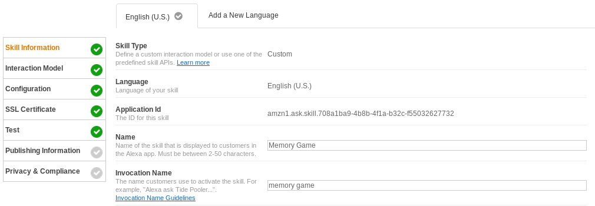
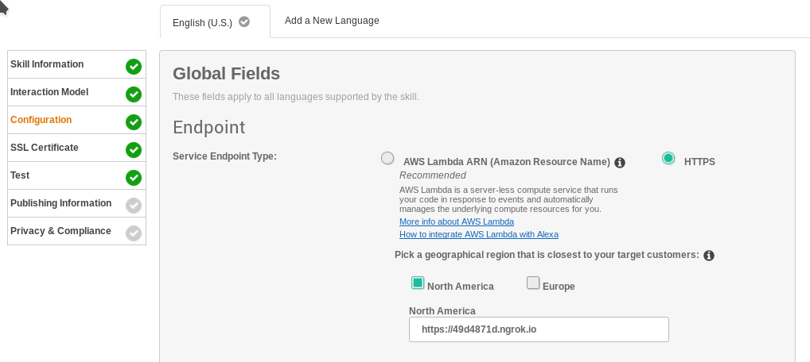
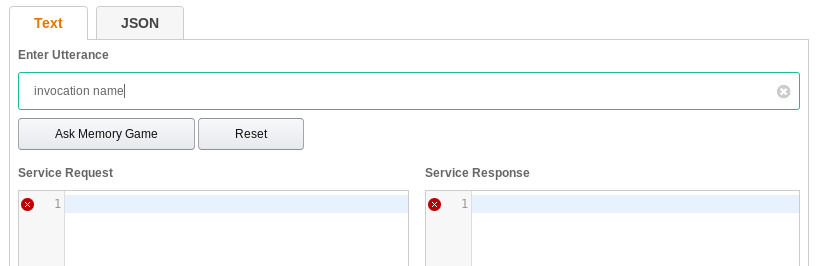

Amazon Echo Teamproject
=======================

## *TODO BY TOMMI:*
1. Recreate shopping example in english as a skill in Python
2. Install Alexa on Raspberry Pi
3. Find a way to enter wifi access on the pi without connecting IO Devices.

----

# Installing and running a sample Alexa Skill
## Prerequisites 
* python
* git 
* flask-server
* flask-ask
* ngrok
* Amazon Developer Account

## Start Amazon Sample App

On __Linux__

1. run `./ngrok http 5000`

On __Windows__

1. run `ngrox.exe http 5000`

2. create sample app at [developer.amazon.com](developer.amazon.com)
3. specify __Skill Information__ and save configuration

4. Fill out __Interaction Model__ (*Intent Schema* and *Sample Utterances*)
5. copy the https Link displayed by ngrok and insert it at the __Configuration__ Tab (Endpoint)

6. Select the __SSL-Certificate__

7. run `python sample.py`
8. Go to __Test__ Tab in the amazon developer console and start the testing with the *Invocation Name* specified at the __Skill Information__ Tab

